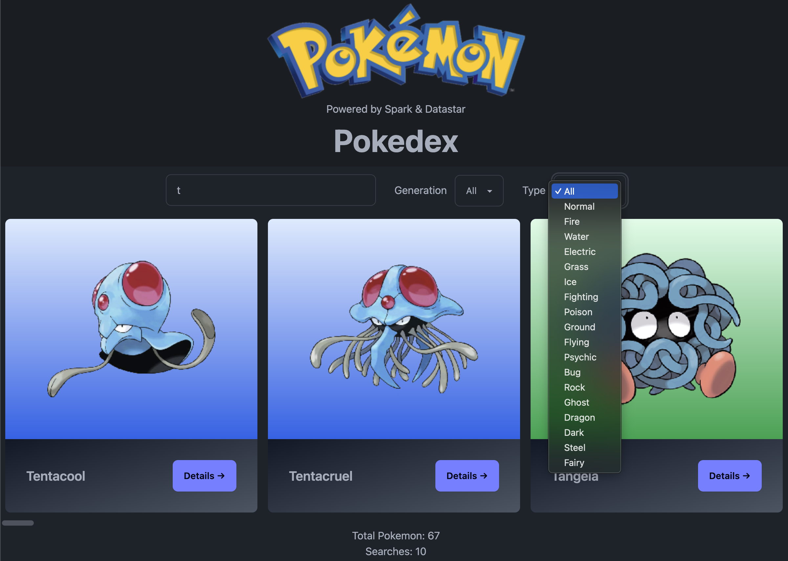

# Craft Datastar Pokemon demo

This project was made for a DotOne conference talk on using the [Craft Datastar](https://github.com/putyourlightson/craft-datastar)
plugin for Craft CMS with [Datastar](https://datastar.fly.dev/) to create reactive UI.

It uses Datastar to provide the frontend reactive UI, coupled with Craft Datastar plugin to interface with the Craft CMS backend.

This allows you to leverage the Craft CMS & Twig APIs that you're used to in order to create dynamic websites.

Below is the full Read Me for "Spin Up Craft", which this demo project is based on.

### About the demo



The demo project uses a Craft CMS database of Pokemon that you can search through via a reactive faceted search.

You can also see a detail page for each Pokemon, with the ability to edit the Pokemon data and save the changes to the
Craft CMS database (assuming you are logged in).

### Acknowledgements

* This project was created using [Spin Up Craft](https://github.com/nystudio107/spin-up-craft)
* The UI components are courtesy of [daisyUI](https://daisyui.com/) & [Tailwind CSS](https://tailwindcss.com/)
* Pokemon database is from [PokemonData](https://github.com/lgreski/pokemonData)
* Pokemon images are
  from [The Complete Pokemon Images Data Set](https://www.kaggle.com/datasets/arenagrenade/the-complete-pokemon-images-data-set)
* Ben Croker for making [Craft Datastar](https://github.com/putyourlightson/craft-datastar) for Craft CMS and helping with the demo

# Spin Up Craft 5.0 Beta

If you want to give the new Craft CMS 5.0 Beta without having to do any setup, this project is for you!

It allows you to spin up the Craft CMS 5.0 Beta in your browser via Github Codespaces, or on your local computer with a
few quick commands.

Whether in-browser or on your local computer, you'll have a fully functional Craft CMS instance with an editor, content,
Twig templates, and a database.

## Spin Up Craft 5.0 Beta in a browser via Github Codespaces

1. Click this button:

[](https://github.com/codespaces/new?hide_repo_select=true&ref=master&repo=877062736)

3. In the resulting Terminal window, type `make dev` to start the project up
3. Wait until you see output like this, and then access the site via the credentials that are output on the console:

```
php_1    | ### Your Craft site is ready!
php_1    | Frontend URL: https://khalwat-laughing-space-zebra-xg9qxvqjpqhp5qx-8050.preview.app.github.dev/
php_1    | CP URL: https://khalwat-laughing-space-zebra-xg9qxvqjpqhp5qx-8050.preview.app.github.dev/admin
php_1    | CP User: admin
php_1    | CP Password: project
```

This lets anyone use the project without having to do _any_ local setup.

You can use the Codespaces editor to edit Twig files, load the site frontend, or log into the Craft CP, all from within
a browser!

The first time you start up your project in Codespaces, it'll take some time to set everything up. However, subsequent
startups will be very quick.

You can access your existing Codespaces here:

https://github.com/codespaces

Click on one to resume it. If you don't see a Terminal window, go to the hamburger menu in the top-left, and click on *
*Terminal > New Terminal**

You are limited to 15 active Codespaces on the free plan, but you can go in and delete any older Codespaces you're not
using at any time.

## Spin Up Craft 5.0 Beta in local dev

1. Have [Docker Desktop](https://www.docker.com/products/docker-desktop/) installed
2. Clone this repository down with `git clone https://github.com/khalwat/spin-up-craft-5.0-beta.git`
3. `cd` to your repo in your terminal
4. Get the project up and running with `make dev`
5. Wait until you see output like this, and then access the site via the credentials that are output on the console:

```
spin-up-craft-50-beta-php-1    | ### Your Craft site is ready!
spin-up-craft-50-beta-php-1    | Frontend URL: http://localhost:8050/
spin-up-craft-50-beta-php-1    | CP URL: http://localhost:8050/admin
spin-up-craft-50-beta-php-1    | CP User: admin
spin-up-craft-50-beta-php-1    | CP Password: project
```

Hit `Control-C` to terminate the project and spin down the containers

The first time you start up your project, it'll take some time to set everything up. However, subsequent startups will
be very quick.

## Available `make` commands

This project uses `make` to execute various commands in the appropriate containers. Here's a list of available commands:

* `make dev` - Start the dev server
* `make composer xxx` - Execute a composer command in the PHP container
* `make craft xxx` - Execute a `craft` CLI command in the PHP container
* `make ssh` - Open up a shell in the PHP container
* `make db-admin-reset` - Reset the admin (user with the `ID=1`) to the defaults in from the `.env` file; useful after
  importing a foreign database
* `make db-export` - Clean the `db-seed/` directory and export the database to it
* `make db-import` - Import the db from `db-seed/` directory into the mysql container

If the project is already running via `make dev` you can use a second terminal tab/window to execute additional
commands.

## Random notes

- The `.env` file is created by copying `example.env` file when you start the project up
- The server will use the `INITIAL_SERVER_PORT` in the `.env` file for the initial port to start looking for unused
  ports from. It will increment it until it finds and unused port, and then use it
- If instead you want to used a fixed port, you can explicitly set the `DEV_SERVER_PORT` in the `.env` file
- The Docker containers will be named after the project directory, so give it a unique name for each project

## To Do

- Enjoy kicking Craft CMS 5.0 Beta's tires!

Brought to you by [nystudio107](https://nystudio107.com/)
